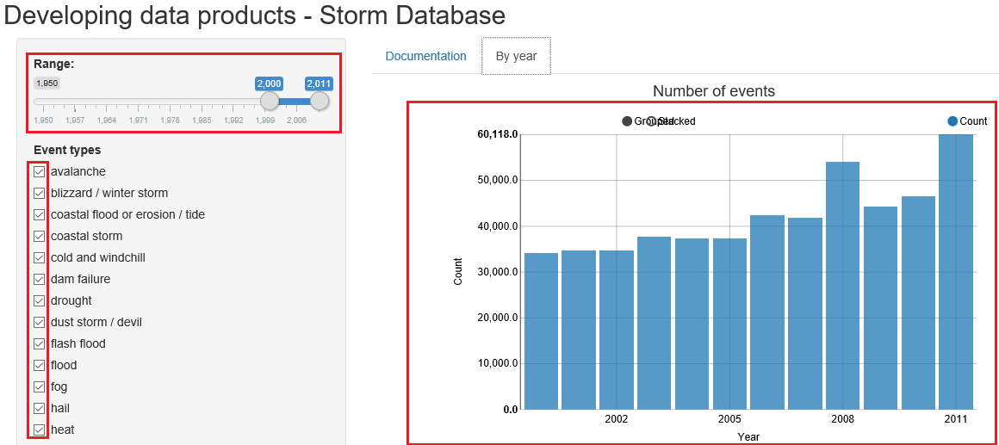

Developing Data Products - Shiny Application
========================================================
author: Joao Gilberto Felix Ribeiro


Project
========================================================


In this project, i created a **Shiny** application, using the **U.S. National Oceanic and Atmospheric Administration's (NOAA) storm database**.
Through the date range and event types, on the side bar, you can interact with the database and see the result in graphs.

Storm database
========================================================


```r
library(data.table)
stormDataTable <- fread('data/events.agg.csv')
head(stormDataTable)
```

```
   YEAR   STATE  EVTYPE COUNT FATALITIES INJURIES PROPDMG CROPDMG
1: 1950 alabama TORNADO     2          0       15 0.02750       0
2: 1951 alabama TORNADO     5          0       13 0.03500       0
3: 1952 alabama TORNADO    13          6      116 5.45250       0
4: 1953 alabama TORNADO    22         16      248 3.07000       0
5: 1954 alabama TORNADO    10          0       36 0.60753       0
6: 1955 alabama TORNADO     8          5       27 7.58000       0
```

Shiny application
========================================================

I used two types of form inputs: slider and checkbox.
The result of interaction is through of the graphs.


Sources
========================================================

The database has been obtained from [here](https://d396qusza40orc.cloudfront.net/repdata%2Fdata%2FStormData.csv.bz2).

Source code for the project is available on the [GitHub](https://github.com/jgfelixribeiro/Developing_Data_Products).

The Shiny application is available on the [Shinyapps.io](https://jgfelixribeiro.shinyapps.io/DevelopingDataProducts).

